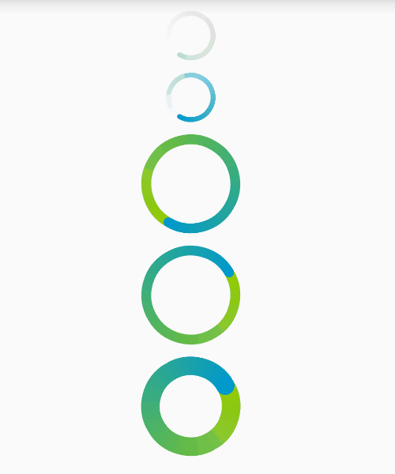

# SmoothRoundProgressbar
# 效果图

 

# 使用

需要指定确定的layout_width和layout_height,两者应该一致.圆环贴着view边缘往内画，不要设置padding，以免变形以及改变了显示效果。

默认结束颜色为浅灰色，开始颜色为白色。

具体项目中，一般改endcolor为需要的颜色即可。

cpb_duration ： 默认1200ms转完一圈。此速度适中，一般无需更改。

cpb_strokeWidth ： 为圆直径的0.1倍，参考安卓原生比例，一般无需更改。

cpb_startColor：默认白色，一般无需更改。

cpb_endColor :浅灰色，能应付大多数场景。如果对颜色有要求，改此属性即可。

    <com.hss01248.roundprogressbar.RoundProgressBar
        android:id="@+id/pb"
        android:layout_centerInParent="true"
        app:cpb_duration = "1200"
        android:layout_width="200dp"
        android:layout_height="200dp" />

# blog

[自定义圆形进度条](http://blog.csdn.net/hss01248/article/details/52089756)